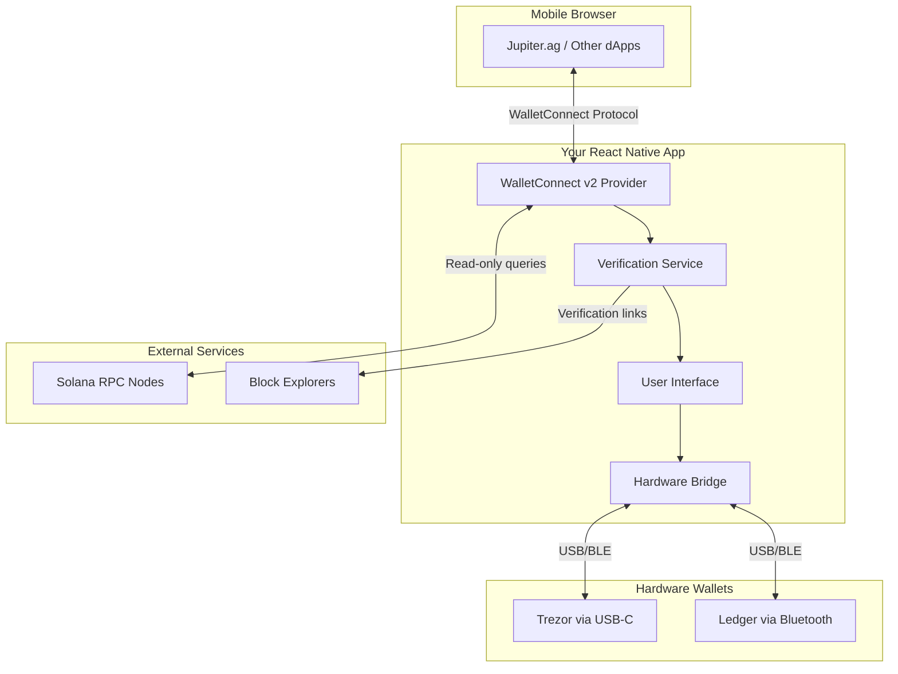
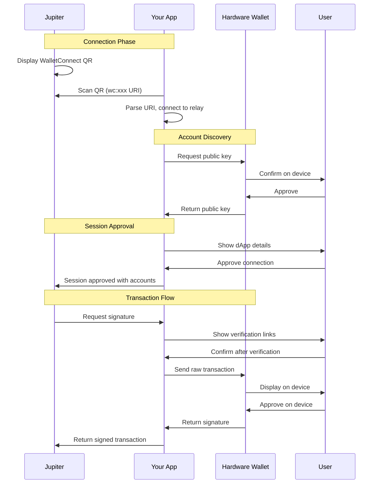
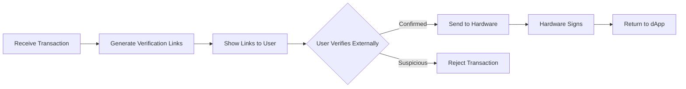
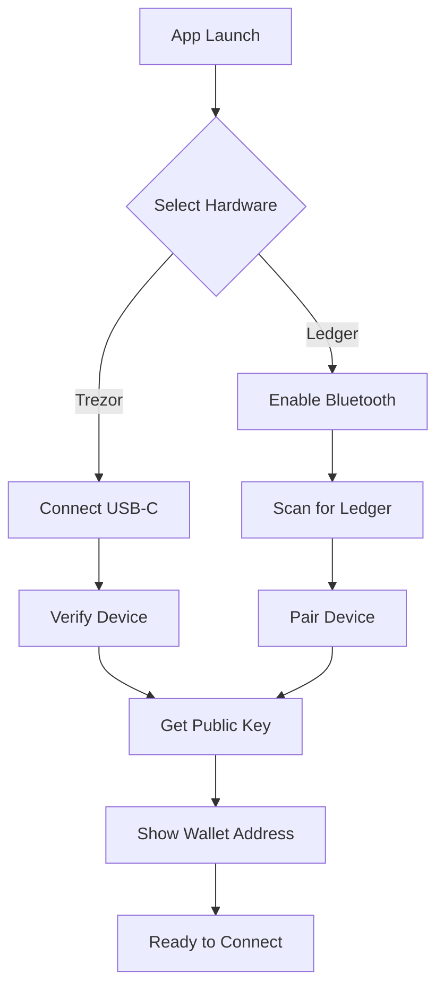
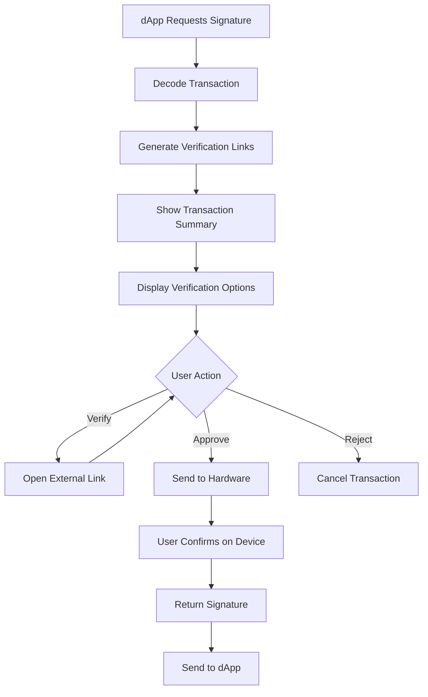

# Technical Specification: Hardware Wallet Bridge for Mobile DeFi

## 1. Executive Summary

### 1.1 Project Overview
Build a React Native mobile application that acts as a WalletConnect v2-compliant bridge between Jupiter DEX (and other Solana dApps) and hardware wallets (Trezor/Ledger). The app enables users to securely sign transactions on hardware wallets while interacting with DeFi protocols on mobile browsers.

### 1.2 Core Security Principle
The app is designed to be "provably dumb" - it cannot access private keys, modify transactions, or act maliciously. All security-critical operations are offloaded to hardware wallets. The app merely facilitates communication between the dApp and hardware wallet.

### 1.3 Target Market
- **Primary**: Asian markets (95% mobile-only users without laptops)
- **Platform**: iOS and Android
- **Users**: DeFi users who want hardware wallet security on mobile

## 2. Architecture Overview



## 3. Technical Requirements

### 3.1 Core Dependencies
```json
{
  "dependencies": {
    "@walletconnect/web3wallet": "^1.x",
    "@walletconnect/utils": "^2.x",
    "@solana/web3.js": "^1.x",
    "@trezor/connect": "^9.x",
    "@ledgerhq/react-native-hw-transport-ble": "^6.x",
    "@ledgerhq/hw-app-solana": "^7.x",
    "react-native-ble-plx": "^3.x",
    "react-native-usb": "^2.x",
    "bs58": "^5.x"
  }
}
```

### 3.2 Platform-Specific Requirements
- **iOS**: Bluetooth permissions, Camera permissions (future QR backup)
- **Android**: USB host mode support, Bluetooth permissions, USB device filters
- **Minimum OS**: iOS 13+, Android 8.0+ (API 26+)

## 4. WalletConnect v2 Implementation

### 4.1 Session Management Flow


### 4.2 Required WalletConnect Methods

#### Signing Methods (Require Hardware)
- `solana_signTransaction` - Sign a single transaction
- `solana_signAllTransactions` - Sign multiple transactions
- `solana_signMessage` - Sign an off-chain message

#### Read-Only Methods (No Hardware Required)
- `solana_requestAccounts` - Return connected accounts
- `getBalance` - Get SOL balance
- `getTokenAccountsByOwner` - Get SPL token balances
- `getAccountInfo` - Get account data
- `getMultipleAccounts` - Batch account fetching
- `simulateTransaction` - Preview transaction effects
- `getRecentBlockhash` - Get recent blockhash
- `getSignaturesForAddress` - Get transaction history

### 4.3 Critical Implementation Details

**IMPORTANT**: The app must implement a FULL WalletConnect v2 provider, not just signing. Jupiter and other dApps expect standard wallet functionality including balance queries and transaction simulation. These read-only operations are handled by querying Solana RPC directly - the hardware wallet is ONLY used for:
1. Getting the public key initially
2. Signing transactions
3. Signing messages

## 5. Hardware Wallet Integration

### 5.1 Security Model
```
RULE: Hardware wallets ONLY handle:
- Private key storage (never exposed)
- Transaction signing (after user confirmation on device)
- Public key derivation

RULE: Hardware wallets CANNOT:
- Parse Solana DeFi transactions (show raw bytes only)
- Fetch balances or blockchain state
- Understand Jupiter swaps or other DeFi operations
```

### 5.2 Trezor Integration
```pseudocode
class TrezorBridge:
    // Use Trezor Connect v9 for React Native
    // Requires USB-C connection on Android
    // Not supported on iOS (no USB access)
    
    function initialize():
        TrezorConnect.init({
            manifest: {
                email: 'support@yourapp.com',
                appUrl: 'https://yourapp.com'
            }
        })
    
    function getPublicKey(path: "m/44'/501'/0'"):
        result = await TrezorConnect.solanaGetPublicKey({
            path: path,
            showOnTrezor: false
        })
        return result.payload.publicKey
    
    function signTransaction(serializedTx: Uint8Array):
        result = await TrezorConnect.solanaSignTransaction({
            path: "m/44'/501'/0'",
            serializedTx: base58.encode(serializedTx)
        })
        if (!result.success):
            throw new Error(result.payload.error)
        return result.payload.signature
```

### 5.3 Ledger Integration
```pseudocode
class LedgerBridge:
    // Use Bluetooth for both iOS and Android
    // Requires Ledger Nano X (Nano S doesn't have Bluetooth)
    
    function initialize():
        // Request Bluetooth permissions
        await requestBluetoothPermissions()
        
    function scanForDevices():
        devices = await TransportBLE.list()
        return devices
    
    function connect(deviceId: string):
        transport = await TransportBLE.open(deviceId)
        solanaApp = new Solana(transport)
        
        // Verify correct app is open
        appConfig = await solanaApp.getAppConfiguration()
        if (appConfig.name !== 'Solana'):
            throw new Error('Please open Solana app on Ledger')
    
    function signTransaction(serializedTx: Uint8Array):
        signature = await solanaApp.signTransaction(
            "44'/501'/0'",
            Buffer.from(serializedTx)
        )
        return signature
```

### 5.4 Chain Confusion Prevention

**CRITICAL SECURITY REQUIREMENT**: Prevent cross-chain attacks where a malicious dApp tries to get the user to sign an Ethereum transaction thinking it's Solana (or vice versa).

```pseudocode
class ChainSafetyManager:
    currentChain: 'solana' | 'ethereum' | null
    
    function validateTransaction(tx: any, expectedChain: string):
        // For Solana
        if (expectedChain === 'solana'):
            assert(tx.recentBlockhash exists)
            assert(tx.instructions exists)
            assert(tx.feePayer exists)
            
            // Check for Solana program IDs
            for instruction in tx.instructions:
                assert(isValidSolanaProgram(instruction.programId))
        
        // For Ethereum (if supported later)
        if (expectedChain === 'ethereum'):
            assert(tx.chainId exists)
            assert(tx.nonce exists)
            assert(tx.gasLimit exists)
            
        // Ledger: Verify correct app is open
        if (usingLedger):
            openApp = await ledger.getOpenApp()
            assert(openApp === expectedChain)
```

## 6. Transaction Verification System

### 6.1 Pre-Signing Verification Flow


### 6.2 Verification Link Generation
```pseudocode
class VerificationService:
    function generateVerificationLinks(transaction: Transaction):
        serialized = transaction.serialize()
        base58Tx = bs58.encode(serialized)
        
        return {
            // Primary inspector
            solscan: `https://solscan.io/tx/inspector?message=${base58Tx}&cluster=mainnet`,
            
            // Alternative inspectors
            solanaFM: `https://solana.fm/tx/inspector?message=${base58Tx}&cluster=mainnet-beta`,
            
            // DeFi-specific analyzer
            blowfish: `https://blowfish.xyz/simulate?tx=${base58Tx}&chain=solana`,
            
            // For Jupiter swaps specifically
            jupiter: extractJupiterRoute(transaction)
        }
    
    function extractJupiterRoute(tx: Transaction):
        jupiterIx = tx.instructions.find(ix => 
            ix.programId === "JUP6LkbZbjS1jKKwapdHNy74zcZ3tLUZoi5QNyVTaV4"
        )
        if (jupiterIx):
            // Parse and return Jupiter verification URL
            return `https://jup.ag/swap/${inputMint}-${outputMint}`
```

### 6.3 User Interface Requirements
The verification screen MUST:
1. Show transaction details in human-readable format
2. Display multiple verification links (user chooses which to trust)
3. Show clear warnings for unusual transactions
4. Require explicit user confirmation before hardware signing
5. Display instructions: "Please verify amounts and recipients match on external site"

## 7. Security Requirements & Attack Vectors

### 7.1 Attack Vectors to Prevent

| Attack Vector | Prevention Method | Implementation |
|--------------|------------------|----------------|
| Malicious transaction modification | Transactions are signed by hardware wallet | Hardware enforces signature validity |
| Cross-chain confusion | Chain validation before signing | Verify Ledger app matches chain |
| Phishing dApps | Show dApp URL prominently | User verifies domain |
| Transaction replay | Include recent blockhash | Solana enforces blockhash expiry |
| Amount manipulation | External verification links | User verifies on block explorer |
| Blind signing | Show verification links | User can inspect before signing |

### 7.2 Security Design Principles
```
1. NEVER store private keys in the app
2. NEVER modify transactions (pass-through only)
3. ALWAYS show external verification options
4. ALWAYS verify chain before hardware signing
5. NEVER trust dApp-provided data without verification
6. ALWAYS fail closed (reject if uncertain)
```

### 7.3 What This App Does NOT Protect Against
- **Malicious dApps**: If user connects to a scam site, hardware wallet can't detect it
- **User negligence**: If user doesn't verify transactions, they can still sign malicious ones
- **Blind signing**: Hardware wallets can't parse DeFi transactions meaningfully
- **Social engineering**: User can still be tricked into signing bad transactions

## 8. User Experience Flow

### 8.1 First-Time Setup


### 8.2 Transaction Signing Flow


## 9. React Native Implementation Structure

### 9.1 Project Structure
```
src/
├── services/
│   ├── walletconnect/
│   │   ├── WalletConnectProvider.ts    # Main WC2 implementation
│   │   ├── SessionManager.ts           # Session handling
│   │   └── MethodHandlers.ts           # RPC method implementations
│   ├── hardware/
│   │   ├── HardwareWalletInterface.ts  # Abstract interface
│   │   ├── TrezorBridge.ts            # Trezor implementation
│   │   └── LedgerBridge.ts            # Ledger implementation
│   ├── verification/
│   │   ├── VerificationService.ts      # Link generation
│   │   └── TransactionParser.ts        # TX parsing
│   └── rpc/
│       └── SolanaRPCService.ts         # Blockchain queries
├── screens/
│   ├── ConnectionScreen.tsx            # WalletConnect pairing
│   ├── VerificationScreen.tsx          # Pre-sign verification
│   ├── HardwareSignScreen.tsx          # Hardware interaction
│   └── SettingsScreen.tsx              # Device management
├── components/
│   ├── TransactionSummary.tsx          # Human-readable TX display
│   ├── VerificationLinks.tsx           # External link buttons
│   └── HardwareStatus.tsx              # Connection status
└── utils/
    ├── security/
    │   ├── ChainValidator.ts           # Chain confusion prevention
    │   └── ProgramValidator.ts         # Known program verification
    └── storage/
        └── SessionStorage.ts            # WC session persistence
```

### 9.2 State Management
```pseudocode
// Use Redux or Zustand for global state
GlobalState = {
    walletConnect: {
        sessions: Map<string, Session>,
        activeSession: string | null,
        pendingRequests: Request[]
    },
    hardware: {
        connected: boolean,
        type: 'trezor' | 'ledger' | null,
        publicKey: string | null,
        deviceId: string | null
    },
    verification: {
        currentTransaction: Transaction | null,
        verificationLinks: Links | null,
        userApproved: boolean
    }
}
```

## 10. Testing Requirements

### 10.1 Critical Test Cases
1. **Chain Confusion Test**: Attempt to sign Ethereum TX with Solana app open
2. **Malformed Transaction Test**: Send invalid transaction format
3. **Session Hijacking Test**: Attempt to use expired session
4. **Bluetooth Disconnection Test**: Disconnect during signing
5. **App Background Test**: iOS/Android background handling during signing

### 10.2 Integration Tests
```pseudocode
describe('Jupiter Integration', () => {
    test('Can connect to Jupiter.ag')
    test('Displays correct swap amounts')
    test('Handles token account discovery')
    test('Processes swap transaction correctly')
    test('Returns valid signature to Jupiter')
})

describe('Hardware Wallet Tests', () => {
    test('Ledger: Correct app verification')
    test('Trezor: USB connection handling')
    test('Both: Signature verification')
    test('Both: Derivation path correctness')
})
```

## 11. Platform-Specific Considerations

### 11.1 iOS Limitations
- **NO USB SUPPORT**: Trezor won't work on iOS (no USB access)
- **Bluetooth only**: Only Ledger Nano X via Bluetooth
- **Background limitations**: WalletConnect connection may drop in background

### 11.2 Android Requirements
- **USB Host Mode**: Required for Trezor (not all devices support)
- **Bluetooth**: For Ledger
- **Manifest permissions**: USB device filters for Trezor detection

### 11.3 React Native Specific
```xml
<!-- android/app/src/main/AndroidManifest.xml -->
<uses-feature android:name="android.hardware.usb.host" />
<uses-permission android:name="android.permission.BLUETOOTH"/>
<uses-permission android:name="android.permission.BLUETOOTH_ADMIN"/>
<uses-permission android:name="android.permission.ACCESS_FINE_LOCATION"/>

<!-- iOS Info.plist -->
<key>NSBluetoothAlwaysUsageDescription</key>
<string>Connect to Ledger hardware wallet</string>
<key>UISupportedExternalAccessoryProtocols</key>
<array>
    <string>com.ledger.hid</string>
</array>
```

## 12. Error Handling

### 12.1 User-Facing Error Messages
```pseudocode
ErrorMessages = {
    WRONG_CHAIN: "Wrong Ledger app open. Please open Solana app.",
    DEVICE_DISCONNECTED: "Hardware wallet disconnected. Please reconnect.",
    TRANSACTION_REJECTED: "Transaction rejected on hardware device.",
    INVALID_TRANSACTION: "Invalid transaction format. Cannot sign.",
    VERIFICATION_FAILED: "Transaction simulation failed. This transaction may fail.",
    SESSION_EXPIRED: "Connection expired. Please reconnect to dApp."
}
```

### 12.2 Recovery Flows
- Auto-reconnect for Bluetooth disconnections
- Session recovery after app restart
- Transaction retry mechanism
- Clear error states with user action guidance

## 13. Performance & Optimization

### 13.1 Optimization Requirements
- Cache RPC responses (5-second TTL for balances)
- Debounce verification link generation
- Lazy load hardware wallet libraries
- Minimize blockchain queries
- Implement connection pooling for RPC

### 13.2 Battery Considerations
- Bluetooth LE for Ledger (not classic Bluetooth)
- Disconnect hardware when not in use
- Avoid polling; use event-driven updates

## 14. Deployment & Distribution

### 14.1 App Store Requirements
- Clear description of hardware wallet usage
- Privacy policy explaining no private key storage
- Terms of service disclaiming liability
- Support contact for users

### 14.2 Open Source Considerations
- MIT or Apache 2.0 license
- Reproducible builds for verification
- Clear build instructions
- Security disclosure process

## 15. Future Considerations (Out of Scope for MVP)

- Multiple account support
- Ethereum/EVM chain support
- Custom RPC endpoint configuration
- Transaction history
- In-app browser (security risk - avoid)
- UR/CBOR QR code support (incompatible with Jupiter currently)

## 16. Success Metrics

The implementation is successful if:
1. ✅ Connects to Jupiter.ag via WalletConnect
2. ✅ Displays token balances correctly
3. ✅ Shows verification links before signing
4. ✅ Successfully signs transactions with hardware wallet
5. ✅ Transactions execute on-chain after signing
6. ✅ Cannot sign cross-chain transactions
7. ✅ App cannot access private keys (provably secure)

## 17. Implementation Notes for Code Generation

**CRITICAL**: 
- This is NOT a traditional wallet. It's a bridge between WalletConnect dApps and hardware wallets.
- The app should be "dumb" - it cannot create transactions, only relay them.
- All security comes from the hardware wallet, not the app.
- Focus on verification and transparency, not features.
- When in doubt, fail safely (reject rather than risk signing something malicious).

**WARNING**: 
- Do not implement any private key management
- Do not store seed phrases
- Do not create transactions
- Do not modify transactions
- Do not cache sensitive data
- Do not trust dApp-provided information without verification

This specification provides a complete blueprint for implementing a secure hardware wallet bridge for mobile DeFi usage, specifically optimized for Jupiter and the Asian mobile-first market.